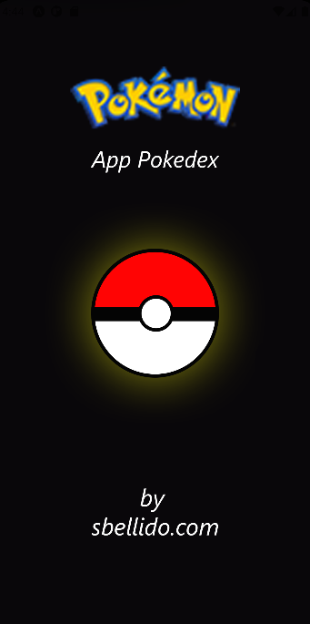
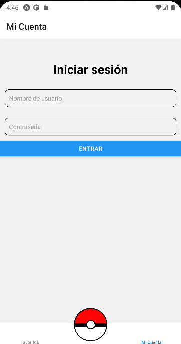
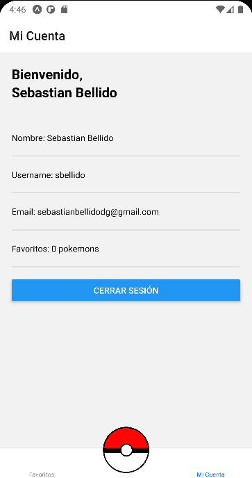
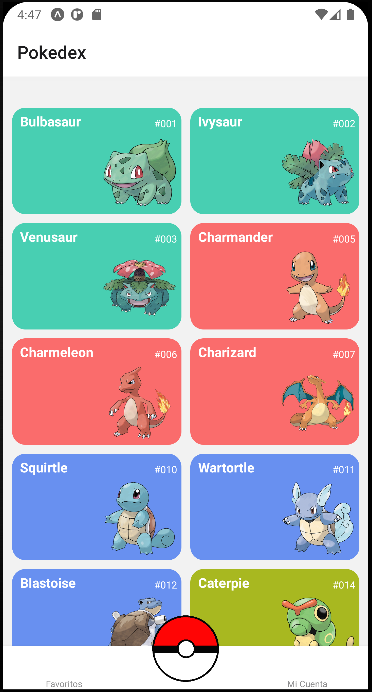
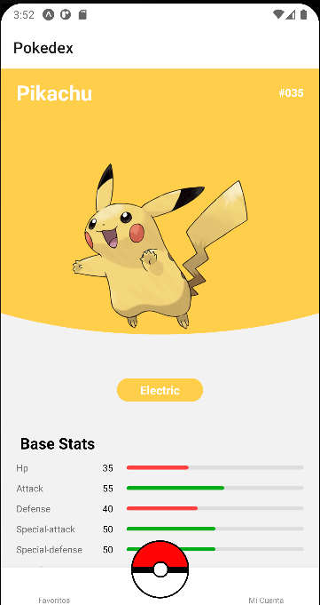

## Inicialización del Proyecto

Para inicializar el proyecto en tu entorno local, sigue estos pasos:

1. Asegúrate de tener Node.js instalado en tu computadora.
2. Clona este repositorio en tu máquina local utilizando el siguiente comando:

git clone https://github.com/SBellido/Idun.git

3. Navega al directorio del proyecto:

cd idun

4. Instala las dependencias utilizando Yarn:

yarn install

5. Una vez instaladas las dependencias, puedes ejecutar el proyecto utilizando Expo:

yarn start

Esto abrirá la interfaz de Expo en tu navegador y te proporcionará opciones para ejecutar el proyecto en un emulador, dispositivo físico o en la web.

› Using Expo Go
› Press s │ switch to development build

› Press a │ open Android
› Press w │ open web

› Press j │ open debugger
› Press r │ reload app
› Press m │ toggle menu
› Press o │ open project code in your editor

› Press ? │ show all commands

---

### Nota de Acceso

Para ejecutar el proyecto, es necesario iniciar sesión con las siguientes credenciales:

- **Usuario:** sbellido
- **Contraseña:** 27101979

## Capturas de Pantalla

Aquí se muestran algunas capturas de pantalla de las secciones principales del proyecto:

---

**Nota:** Este proyecto se llama "Idun" y se utilizará como base en Expo Go para desarrollar "Idun".

# Curso de Introducción a React Native

Este repositorio contiene los proyectos desarrollados durante el curso de Introducción a React Native. En este curso, aprenderás a configurar tu entorno de trabajo local con React Native utilizando Expo, emuladores y dispositivos móviles reales. Además, repasarás los fundamentos de React.js aplicados a React Native.

## Contenido del Curso

### 1. Configuración del Entorno de Trabajo

- Instalación de Expo CLI
- Creación de un nuevo proyecto en React Native
- Ejecución en emuladores y dispositivos móviles reales

### 2. Fundamentos de React Native

- Repaso de los conceptos básicos de React.js
- Creación y manipulación de componentes en React Native
- Estilizado de componentes con StyleSheet

### 3. Proyecto Práctico: Consumo de API de Pokemon

- Construcción de un proyecto práctico en React Native
- Implementación de flujos de navegación con React Navigation
- Renderización de listas y estadísticas de Pokemon obtenidas desde la API de Pokemon

## Recursos Adicionales

- [Documentación de React Native](https://reactnative.dev/docs/getting-started)
- [Documentación de Expo](https://docs.expo.io/)

Este repositorio contiene los proyectos desarrollados durante el curso de Introducción a React Native. En este curso, aprenderás a configurar tu entorno de trabajo local con React Native utilizando Expo, emuladores y dispositivos móviles reales. Además, repasarás los fundamentos de React.js aplicados a React Native.

## Descargar el Proyecto

Para descargar este proyecto en tu computadora, sigue estos pasos:

1. Asegúrate de tener instalado [Node.js](https://nodejs.org/) en tu computadora.
2. Abre una terminal o línea de comandos.
3. Navega hasta la ubicación donde deseas descargar el proyecto.
4. Ejecuta el siguiente comando para clonar el repositorio:

Reemplaza `tu-usuario` y `nombre-del-repositorio` con tu nombre de usuario de GitHub y el nombre del repositorio, respectivamente.

5. Una vez clonado el repositorio, navega al directorio del proyecto:

6. Instala las dependencias del proyecto utilizando Yarn:

Esto instalará todas las dependencias necesarias para ejecutar el proyecto.

7. ¡Listo! Ahora puedes empezar a trabajar con el proyecto en tu entorno local.

Recuerda que este proyecto utiliza Yarn como gestor de paquetes. Si no tienes Yarn instalado, puedes encontrar instrucciones de instalación en [su sitio web](https://classic.yarnpkg.com/en/docs/install/).
